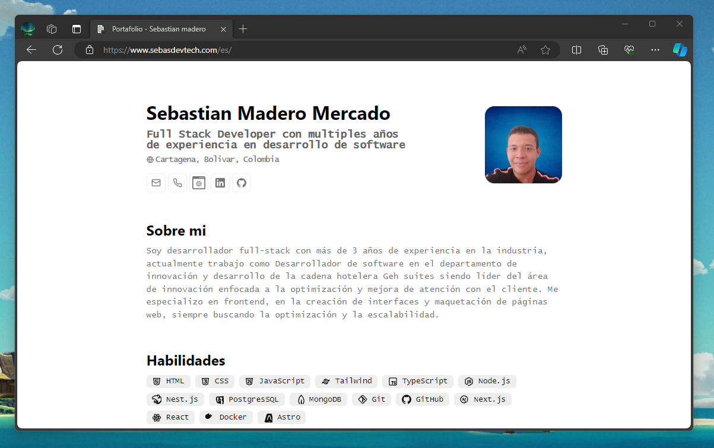

<div align="center">
 
<h2>
    Hoja de vida/Portafolio.
</h2>

<p>
Basado en el diseño de <a href="https://github.com/midudev/minimalist-portfolio-json">Midudev</a>
</p>

</div>

<div align="center">
    <a href="#🚀-empezar">
        Empezar
    </a>
    <span>&nbsp;✦&nbsp;</span>
    <a href="#🧞-comandos">
        Comandos
    </a>
    <span>&nbsp;✦&nbsp;</span>
    <a href="#🔑-licencia">
        Licencia
    </a>
   
</div>

## Descripcion

<p>Portafolio minimalista con ventana de comando, e internacionalización en ingles y español.</p>

</img>

## 🛠️ Stack

- [**Astro**](https://astro.build/)
- [**Typescript**](https://www.typescriptlang.org/)
- [**Ninja Keys**](https://github.com/ssleptsov/ninja-keys)


## Empezar

### 1. Clonar este [repositorio](https://github.com/Sebmm3010/Portfolio).


- Instalar dependecias.

### 2. Cambiar contenido:
Edita contenido de los archivos `info-ge.json`, `info-es.json`, `info-en.json` para editar el portafolio en español y en ingles.
### 3. Lanza el servidor de desarrollo:

```bash
npm run dev
```


1. Abre [**http://localhost:4321**](http://localhost:4321/).


## 🧞 Comandos

All commands are run from the root of the project, from a terminal:

| Command                   | Action                                           |
| :------------------------ | :----------------------------------------------- |
| `npm install`             | Instalar dependecias                            |
| `npm run dev`             | Iniciar servidor de desarrollo `localhost:4321`      |
| `npm run build`           | Construir sitio en produccion en la capeta `./dist/`          |
| `npm run preview`         | Preview del build de produccion     |


## 🔑 Licencia

[MIT](LICENSE.txt) - Creado por [**Sebastian madero**](https://www.sebasdevtech.com).
